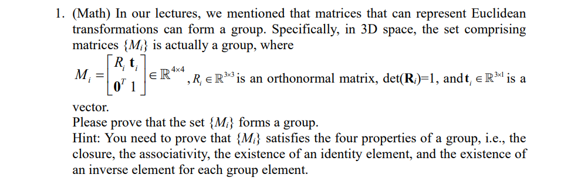
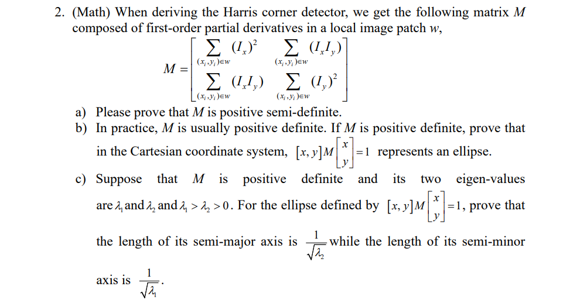
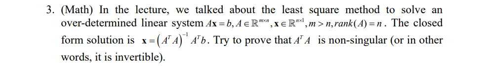

To prove that $\{M_i\}$ forms a group, we have to prove that $\{M_i\}$ satisfies the 4 properties of a group.
1. closure
   
    $
    \forall M_i,M_j\in\mathbb{R}^{4\times 4},M_i=\begin{bmatrix}R_i&t_i\\0^T&1\\ \end{bmatrix},M_j=\begin{bmatrix}R_j&t_j\\0^T&1\\ \end{bmatrix},M_i\cdot M_j=\begin{bmatrix}R_iR_j&R_it_j+t_i\\0^T&1\\ \end{bmatrix},(R_iR_j)^TR_iR_j=R_j^TR_i^TR_iR_j$

    Since $R_i$ and $R_j$ are orthonormal matrices, we have $R_i^{-1}=R_i^T,R_j^{-1}=R_j^T$,therefore, $(R_iR_j)^TR_iR_j=I\cdot I=I$, so $R_iR_j\in\mathbb{R}^{3\times 3}$ is also an orthonormal matrix.

    $det(R_iR_j)=det(R_i)det(R_j)=1$

    $\because R_it_j\in \mathbb{R}^{3\times 1},\therefore R_it_j+t_i\in\mathbb{R}^{3\times 1}$

    $\therefore M_i\cdot M_j\in{M_i}$

    so ${M_i}$ satisfies the closure property.

2. associativity
   
   $\forall M_i,M_j,M_k\in{M_i},(M_i\cdot M_j)\cdot M_k=\begin{bmatrix}R_iR_j&R_it_j+t_i\\0^T&1\\ \end{bmatrix}\begin{bmatrix}R_k&t_k\\0^T&1\\ \end{bmatrix}=\begin{bmatrix}R_iR_jR_k&R_iR_jt_k+R_it_j+t_i\\0^T&1\\ \end{bmatrix}$

   $M_i\cdot(M_j\cdot M_k)=\begin{bmatrix}R_i&t_i\\0^T&1\\ \end{bmatrix}\begin{bmatrix}R_jR_k&R_jt_k+t_j\\0^T&1\\ \end{bmatrix}$
   
3. existence of an identity element
   
   let $M_0=\begin{bmatrix}I_3&0\\0^T&1\\ \end{bmatrix},\forall M_i=\begin{bmatrix}R_i&t_i\\0^T&1\\ \end{bmatrix}\in\mathbb{R}^{4\times 4},M_i\cdot M_0=\begin{bmatrix}R_i&t_i\\0^T&1\\ \end{bmatrix}=M_i,M_0\cdot M_i=\begin{bmatrix}R_i&t_i\\0^T&1\\ \end{bmatrix}=M_i,\therefore M_0$ is an identity element of $\mathbb{R}^{4\times 4}$.

4. existence of an inverse element for each group element
   
   $M_j=\begin{bmatrix}R_j&t_j\\0^T&1\\ \end{bmatrix}$, its inverse matrix is $M_j^{-1}=\begin{bmatrix}R_j^{-1}&R_j^{-1}t_j\\0^T&1\\ \end{bmatrix}$

    First, we have to prove that $R_j^{-1}$ belongs to $R_i$:

   $\because (R_j^TR_j)^{-1}=R_j^{-1}(R_j^{-1})^T=I$

   $det(R_j^{-1})=\frac{1}{det(R_j)}=1$

   $\therefore R_j^{-1}\in\{R_j\}$

   $R_j^{-1}t_j\in\mathbb{R}^{3\times 1}$

a) To prove that `M` is positive semi-definite, we can prove that its eigenvalues (noted as $\lambda_1$ and $\lambda_2$) are non-negative.

$det(M)=\lambda_1\lambda_2=\Sigma_{(x_i,y_i)\in w}(I_x)^2\Sigma_{(x_i,y_i)\in w}(I_y)^2-(\Sigma_{(x_i,y_i)\in w}(I_xI_y))^2$

According to Caushy-Schwarz inequation, $det(M)\geq0$

$tr(M)=\lambda_1+\lambda_2=\Sigma_{(x_i,y_i)\in w}(I_x)^2+\Sigma_{(x_i,y_i)\in w}(I_y)^2\geq0$

$\lambda_1\lambda_2\geq0,\lambda_1+\lambda_2\geq0\Rightarrow\lambda_1\geq0,\lambda_2\geq0$

b) $\because M$ is positive definite, $\therefore$ for any non-zero vector $v=[x,y],v^TMv\geq0$

let $A=\Sigma_{(x_i,y_i)\in w}(I_x)^2,B=\Sigma_{(x_i,y_i)\in w}(I_y)^2,C=(\Sigma_{(x_i,y_i)\in w}(I_xI_y))^2,M=\begin{bmatrix}A&C\\C&B\end{bmatrix}$

$$[x,y]M\begin{bmatrix}x\\y\end{bmatrix}=[x,y]\begin{bmatrix}A&C\\C&B\end{bmatrix}\begin{bmatrix}x\\y\end{bmatrix}=[Ax+Cy,Cx+By]\begin{bmatrix}x\\y\end{bmatrix}=Ax^2+2Cxy+By^2=1\tag{1}$$

Since $\Delta=(2C)^2-4AB=4(C^2-AB)<0$ (proof method similar to problem a), (1) represents an ellipse.

c) $\because M$ is positive definite, $\therefore$ the eigenvalues of M (noted as $\lambda_1,\lambda_2$) are positive.

we can write M as $P\Lambda P^T$, where $\Lambda=\begin{bmatrix}\lambda_1&\\&\lambda_2\end{bmatrix}$, P is an orthogonal matrix with all eigenvectors of M.

then we have $(1)=[x,y]P\Lambda P^T\begin{bmatrix}x\\y\end{bmatrix}$

let $[x,y]P=[x',y']$, we have $(1)=[x',y']\Lambda \begin{bmatrix}x'\\y'\end{bmatrix}=\lambda_1x'^2+\lambda_2y'^2=1$

Since $\lambda_1>\lambda_2>0$, we know that (1) represents a ellipse whose semi-major axis's length are $\frac{1}{\sqrt{\lambda_2}},\frac{1}{\sqrt{\lambda_1}}$.

using dim ker `x` to represent the kernel space of `x`,

$\because(A^TA)x=0\Leftrightarrow x^TA^TAx=0\Leftrightarrow (Ax)^TAx=0\Leftrightarrow Ax=0$

$\therefore$ dim ker $A$ = dim ker $A^TA$

for a matrix $M$ with size $m\times n(m>n)$, 

rank($M$) = n - dim ker $M$

so rank($A^TA$) = rank($A$) = n

the size of $A^TA$ is $n\times n$, so det($A^TA$) $\neq$ 0

therefore, $A^TA$ is non-singular.